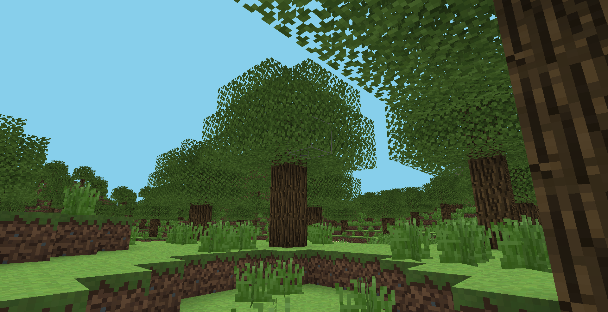
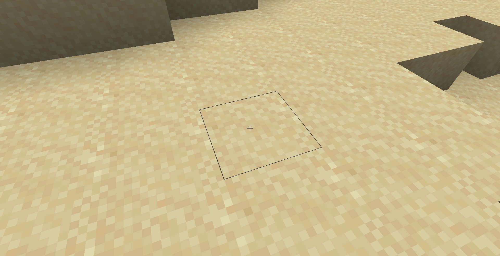

# Voxel Engine (OpenGL)

A simplified Minecraft-inspired voxel engine built in modern C++ using OpenGL, focusing on procedural terrain generation, chunk rendering, and engine architecture.


## Project Goals

This project was created to learn modern C++, OpenGL, multithreading, procedural generation and game engine architecture.

<br>

## Features

- Procedural terrain generation using Perlin noise
- Chunk-based world system
- Multithreaded chunk generation
- Voxel-based Ambient Occlusion
- Water rendering with transparent shaders
- Texture atlas
- Block placement and destruction using raycasting
- Mesh generation with hidden face culling
- Entity Component System (ECS)
- Axis-Aligned Bounding Box (AABB) collision detection and resolution
- Keyboard input state system
- Simple frustum culling

<br>

## Screenshots






<br>

## Engine Systems

- Rendering
- World Generation
- Chunk Streaming
- Entity Component System (ECS)
- Camera System
- Input System
- Physics
- Collision Detection
- Raycasting
- Shader Management
- Texture Management

<br>

## Chunk System

The world is divided into 32 × 256 × 32 voxel chunks. Chunks are generated asynchronously in a background worker thread and streamed around the player based on a configurable generation radius.

The system includes:

- Chunk loading and unloading
- Asynchronous chunk generation
- Mesh generation for solid, water, and decoration blocks
- Priority-based chunk update queue
- Dynamic mesh regeneration after block modifications

## World Generation

Terrain is procedurally generated using multiple Perlin noise maps and several generation passes, including terrain, vegetation, and tree generation.
Generation includes:
- Terrain height
- Mountains
- Oceans
- Trees
- Grass

<br>

## Technologies

- C++
- OpenGL
- GLFW
- GLAD
- GLM
- FastNoiseLite

<br>

## Project Structure
```text
Voxel-Engine-OpenGL/
├── Screenshots/
├── External/
├── Assets/
├── Source/
│   ├── Engine/
│   ├── Game/
│   ├── Physics/
│   ├── Render/
│   ├── Shaders/
│   ├── World/
│   └── main.cpp
├── CMakeLists.txt
└── README.md

```

<br>

## Performance
**Test system**:
- Intel Core i5-12450HX
- NVIDIA RTX 4060 Laptop GPU
- 16 GB DDR5 RAM

**World configuration**:
- Chunk size: 32 × 256 × 32
- Generation radius: 15
- Multithreaded chunk generation

**Results**:
- Average chunk generation time: ~37 ms
- Chunk generation throughput: ~108 chunks/s (~27 chunks/s per worker)
- Average FPS (standing still): ~650
- Average FPS (while generating chunks): ~400–500

<br>

## Building
Clone the repository and build the project using CMake.
The project has been developed and tested on Windows using Visual Studio 2022.

**Controls:** WASD to move, Space to jump, Left Click to break blocks, Right Click to place blocks.

## Challenges
Some of the most challenging parts of the project included:

- Designing a multithreaded chunk generation system.
- Designing a modular engine architecture.
- Optimizing chunk and mesh generation.