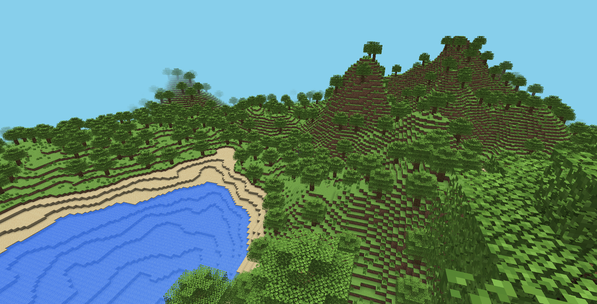
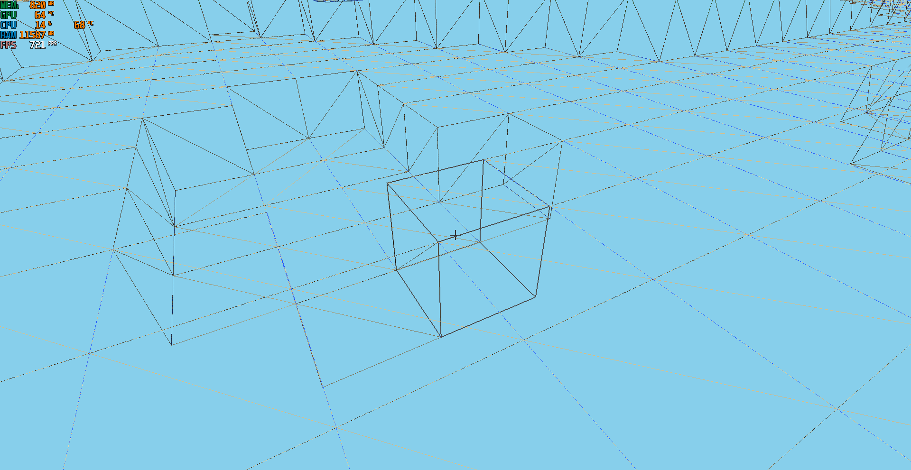

# Voxel Engine (OpenGL)

A simplified Minecraft-inspired voxel engine built in modern C++ using OpenGL, focusing on procedural terrain generation, chunk rendering, and engine architecture.

## Features

- Procedural terrain generation using Perlin noise
- Chunk-based world system
- Multithreaded chunk generation
- Voxel-based Ambient Occlusion
- Water rendering with transparent shaders
- Texture atlas
- Block placement and destruction using raycasting
- Optimized mesh generation
- Entity Component System (ECS)
- Axis-Aligned Bounding Box (AABB) collision detection and resolution
- Keyboard input state system
- Simple frustum culling

## Technologies

- C++
- OpenGL
- GLFW
- GLAD
- GLM
- FastNoiseLite

## World Generation

Terrain is procedurally generated using multiple Perlin noise maps and several generation passes, including terrain, vegetation, and tree generation.

Generation includes:

- Terrain height
- Mountains
- Oceans
- Trees
- Grass

## Screenshots







## Controls

| Key | Action |
|------|--------|
| W A S D | Move |
| Space | Jump |
| Left Click | Break block |
| Right Click | Place block |

## Project Structure

```text
Voxel-Engine-OpenGL/
├── Screenshots/
├── External/
├── Assets/
├── Source/
│   ├── Engine/
│   ├── Game/
│   ├── Physics/
│   ├── Render/
│   ├── Shaders/
│   ├── World/
│   └── main.cpp
├── CMakeLists.txt
└── README.md

```

## Performance
Test system:

- Intel Core i5-12450HX
- NVIDIA RTX 4060 Laptop GPU
- 16 GB DDR5 RAM

World:

- Chunk size: 32 × 256 × 32
- Multithreaded chunk generation

Generation performance:

- Average chunk generation time: ~37 ms
- ~27 chunks/s per worker thread
- Average FPS: 600–700

## Building
Clone the repository and build the project using CMake.
The project has been developed and tested on Windows using Visual Studio 2022.

## Challenges
Some of the most challenging parts of the project included:

- Designing a multithreaded chunk generation system.
- Optimizing chunk and mesh generation.